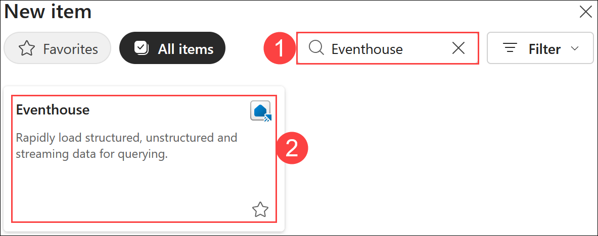
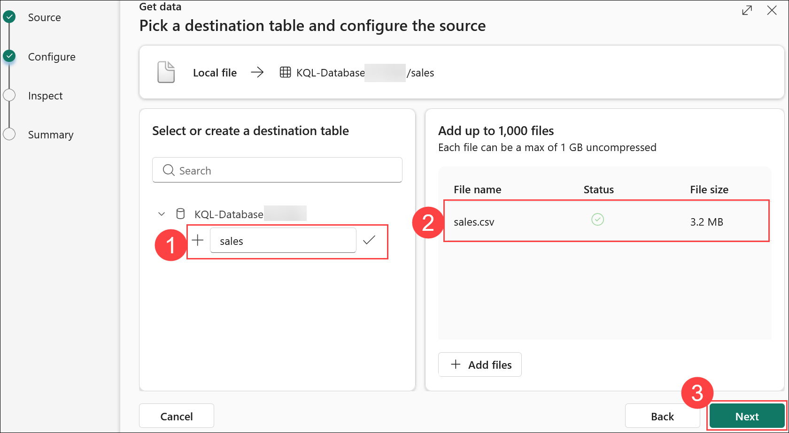
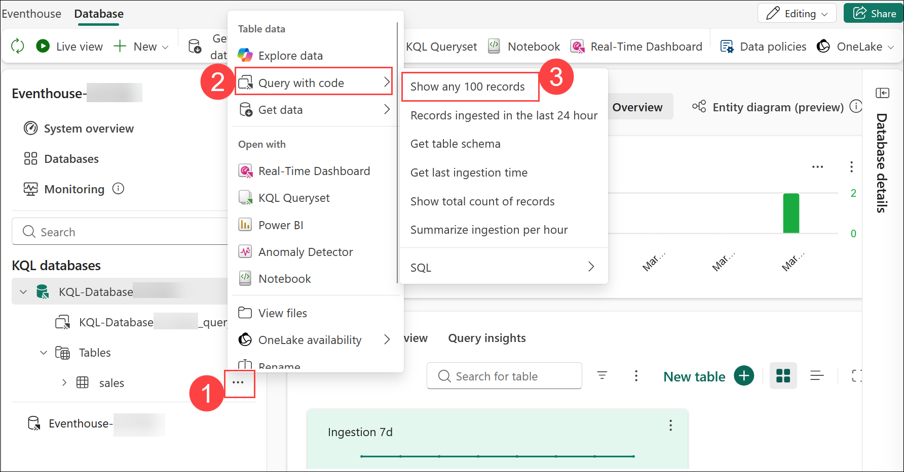
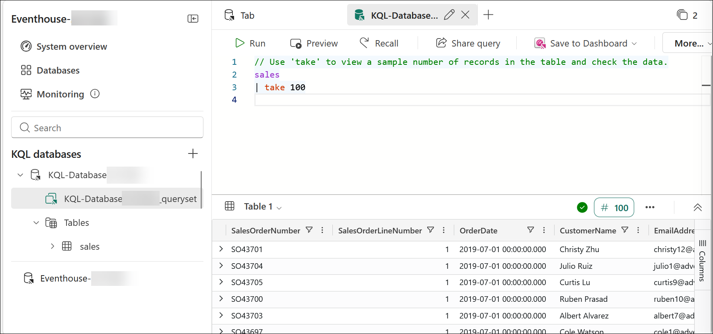
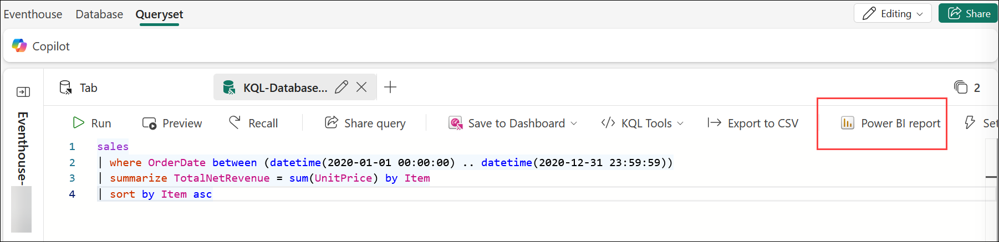
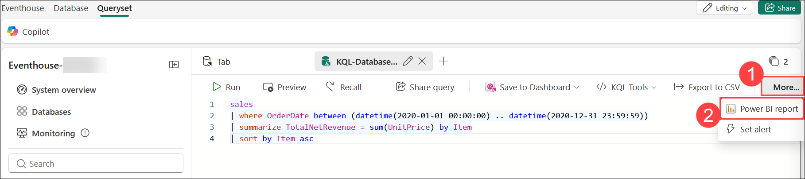

# Exercise 3: Get started with Real-Time Analytics in Microsoft Fabric

### Estimated Duration: 65 Minutes

## Overview

In this exercise, you'll explore real-time analytics in Microsoft Fabric using Kusto Query Language (KQL). You'll begin by creating a KQL database and importing sales data into a table. Then, you'll run KQL queries to analyze the data and create a query set. Using this query set, you’ll build a Power BI report to visualize results. Finally, you'll simulate real-time data ingestion using Spark Structured Streaming and Delta tables to process and query IoT-like data dynamically.

## Lab objectives

You will be able to complete the following tasks:

- Task 1: Create a KQL database
- Task 2: Use KQL to query the sales table
- Task 3: Create a Power BI report from a KQL Queryset
- Task 4: Use delta tables for streaming data
  
## Task 1: Create a KQL database

In this task, you will create a KQL database to facilitate querying of static or streaming data. You will define a table within the KQL database and ingest sales data from a file to enable effective analysis using Kusto Query Language (KQL).

1. In the left pane, navigate to your **Workspace (1)** and click on **fabric-<inject key="DeploymentID" enableCopy="false"/> (2)**, then click on **+ New item (3)** to create a new **Eventhouse**.

    

    
   
1. In the New item section, search for **Eventhouse (1)** and select **Eventhouse (2)** from the list.

    

1. Create a new **Eventhouse** with the name **Eventhouse-<inject key="DeploymentID" enableCopy="false"/> (1)** and click **Create (2)**.

    

1. In the **Welcome to Eventhouse!** pop-up, click **Get started**.

    

1. Once the Eventhouse is created, in the settings pane, click **+ Database** from the top menu for the **KQL Databases**.

   

1. Enter the following details:

   - Database Name: **KQL-Database<inject key="DeploymentID" enableCopy="false"/> (1)**.

   - Click on **Create (2)**.

     

1. In the center of the screen, click on **Get data (1)** and then select **Local file (2)**.

   

1. Use the wizard to import the data into a new table by selecting the following options:
   
    - **Source**:
        - **Database:** *The database you created is already selected*
        - **Table:** Click on **+ New table**.
        - **Name:**  **sales (1)**.
        - **Upload files:** Drag or Browse for the file from **`C:\LabFiles\Files\sales.csv` (2)**
        - Click **Next (3)**

            

    - **Inspect:** Preview the data, enable **First row header (1)** and click on **Finish (2)**.

        
    
    - **Summary:**
    
        - Review the preview of the table and click on **Close**.

            
    
    > **Note:** In this example, you imported a very small amount of static data from a file, which is fine for this exercise. In reality, you can use Kusto to analyze much larger volumes of data, including real-time data from a streaming source such as Azure Event Hubs.

## Task 2: Use KQL to query the sales table

In this task, you will use Kusto Query Language (KQL) to query the sales table in your KQL database. With the data now available, you can write KQL code to extract insights and perform analysis on the sales data.

1. Make sure you have the **sales** table highlighted. Click on **Ellipsis (...) (1)** next to the **sales** table, select the **Query with code (2)**, and then click on **Show any 100 records (3)**.

    

1. A new pane will open with the query and its result. 

    

1. Modify the query as follows:

    ```kusto
   sales
   | where Item == 'Road-250 Black, 48'
    ```

1. **Run** the query. Then review the results, which should contain only the rows for sales orders for the *Road-250 Black, 48* product.

    
   
1. Modify the query as follows:

    ```kusto
   sales
   | where Item == 'Road-250 Black, 48'
   | where datetime_part('year', OrderDate) > 2020
    ```

1. **Run** the query and review the results, which should contain only sales orders for *Road-250 Black, 48* made after 2020.

    

1. Modify the query as follows:

    ```kusto
   sales
   | where OrderDate between (datetime(2020-01-01 00:00:00) .. datetime(2020-12-31 23:59:59))
   | summarize TotalNetRevenue = sum(UnitPrice) by Item
   | sort by Item asc
    ```

1. **Run** the query and review the results, which should contain the total net revenue for each product between January 1st and December 31st 2020, in ascending order of product name.

    

1. From the top open window, select the **KQL-Database<inject key="DeploymentID" enableCopy="false"/> (1)** and rename it to **Revenue by Product (2)**.

    

## Task 3: Create a Power BI report from a KQL Queryset

In this task, you will create a Power BI report using your KQL Queryset as the foundation for the analysis. This allows you to visualize and present the insights derived from your KQL queries in an interactive and user-friendly format within Power BI.

1. In the query workbench editor for your query set, run the query and wait for the results.

1. Select **Power BI Report** and wait for the report editor to open.

    

    > **Note:** If you are unable to see the option due browser resolution,you should see an option **More (1)** click on it, then click on **Power BI Report (2)**

     


1. In the report editor, in the **Data** pane, expand **Kusto Query Result** and select the checkboxes for **Item** and **TotalNet Revenue** fields.

1. On the report design canvas, select the table visualization that has been added, and then in the **Visualizations** pane, select **Clustered bar chart**.

    

1. In the **Power BI (preview)** window, in the **File (1)** menu, select **Save (2)**. Then save the report as **Revenue by Item (3)** in the **fabric-<inject key="DeploymentID" enableCopy="false"/> (4)** where your lakehouse and KQL database are defined using a **Non-Business** sensitivity label from the drop-down. Click on **Continue (5)**

    

    

    >**Note:** If you are not getting option to **Save** the report in the **fabric-<inject key="DeploymentID" enableCopy="false"/>** then follow the below steps:

    -  Enter the file name as **Revenue by Item** and click **Continue** to save the Power BI report to the workspace.

         

    -  The report has been saved successfully. Now, click on **Open the file in Power BI to view, edit, and get a shareable link** to proceed.

         

    - Click **File (1)** and then select **Save a copy (2)** to duplicate the Power BI report to your workspace.
         
         

    - Select **fabric-<inject key="DeploymentID" enableCopy="false"/> (1)** where you want to save the copied report, enter a name as **Revenue by Item (2)**, and click the **Save (3)** button to finalize the copy.
       
         

        >**Note**: Refresh the Workspace page if necessary to view all of the items it contains.

1. In the list of items in your workspace, note that the **Revenue by Item** report is listed.

> **Congratulations** on completing the task! Now, it's time to validate it. Here are the steps:
> - If you receive a success message, you can proceed to the next task.
> - If not, carefully read the error message and retry the step, following the instructions in the lab guide. 
> - If you need any assistance, please contact us at cloudlabs-support@spektrasystems.com. We are available 24/7 to help you out.

<validation step="f0432ac8-2698-4432-be77-0a69568c2d09" />

## Task 4: Use delta tables for streaming data

In this task, you will use Delta tables to handle streaming data, leveraging their capabilities for real-time data processing. Specifically, you will implement a Delta table as a sink for streaming data in a simulated Internet of Things (IoT) scenario, utilizing the Spark Structured Streaming API.

1. In the left pane, click oto your workspace **fabric-<inject key="DeploymentID" enableCopy="false"/> (1)** and then open **Load Sales Notebook (2)** that is listed under your workspace.

    

1. Add a new code cell in the notebook using **+ Code**. Then, in the new cell, add the following **code (1)** and **run (2)** it:

   ```python
   from notebookutils import mssparkutils
   from pyspark.sql.types import *
   from pyspark.sql.functions import *

   # Create a folder
   inputPath = 'Files/data/'
   mssparkutils.fs.mkdirs(inputPath)

   # Create a stream that reads data from the folder, using a JSON schema
   jsonSchema = StructType([
   StructField("device", StringType(), False),
   StructField("status", StringType(), False)
   ])
   iotstream = spark.readStream.schema(jsonSchema).option("maxFilesPerTrigger", 1).json(inputPath)

   # Write some event data to the folder
   device_data = '''{"device":"Dev1","status":"ok"}
   {"device":"Dev1","status":"ok"}
   {"device":"Dev1","status":"ok"}
   {"device":"Dev2","status":"error"}
   {"device":"Dev1","status":"ok"}
   {"device":"Dev1","status":"error"}
   {"device":"Dev2","status":"ok"}
   {"device":"Dev2","status":"error"}
   {"device":"Dev1","status":"ok"}'''
   mssparkutils.fs.put(inputPath + "data.txt", device_data, True)
   print("Source stream created...")
   ```

    

1. Ensure the message **Source stream created... (3)** is printed. The code you just ran has created a streaming data source based on a folder to which some data has been saved, representing readings from hypothetical IoT devices.

1. Add a **new code cell**, and run the following **code (1)** by clicking on **Run (2)** button:

    ```python
   # Write the stream to a delta table
   delta_stream_table_path = 'Tables/iotdevicedata'
   checkpointpath = 'Files/delta/checkpoint'
   deltastream = iotstream.writeStream.format("delta").option("checkpointLocation", checkpointpath).start(delta_stream_table_path)
   print("Streaming to delta sink...")
    ```

    

1. This code writes the streaming device data in delta format to a folder named **iotdevicedata**. Because the path for the folder location is in the **Tables** folder, a table will automatically be created for it.

1. Add a new code cell, and **run** the following **code**:

    ```SQL
   %%sql

   SELECT * FROM IotDeviceData;
    ```

    

1. This code queries the **IotDeviceData** table, which contains the device data from the streaming source.

1. Add a new code cell, and run the following code:

    ```python
   # Add more data to the source stream
   more_data = '''{"device":"Dev1","status":"ok"}
   {"device":"Dev1","status":"ok"}
   {"device":"Dev1","status":"ok"}
   {"device":"Dev1","status":"ok"}
   {"device":"Dev1","status":"error"}
   {"device":"Dev2","status":"error"}
   {"device":"Dev1","status":"ok"}'''

   mssparkutils.fs.put(inputPath + "more-data.txt", more_data, True)
    ```

    

1. This code writes more hypothetical device data to the streaming source.

1. **Re-run (1)** the cell containing the following code:

    ```SQL
   %%sql

   SELECT * FROM IotDeviceData;
    ```

    

1. This code queries the **IotDeviceData** table again, which should now include the **additional data (2)** that was added to the streaming source.

1. Add a new code cell, and run the following code:

    ```python
   deltastream.stop()
    ```

    

    >**Note**: This code stops the stream.

1. Click the **Stop (■)** button to end the session before proceeding.

    

## Summary

In this exercise, you:
- Created a Lakehouse to store and manage structured data.
- Set up a KQL (Kusto Query Language) database to analyze the data stored in the Lakehouse.
- Used KQL queries to explore and extract insights from the data.
- Created a query set based on your KQL analysis.
- Used the query set as the data source for a Power BI report to visualize the results.

### You have successfully completed the exercise. Click on Next >> to proceed with the next exercise.

.png)
