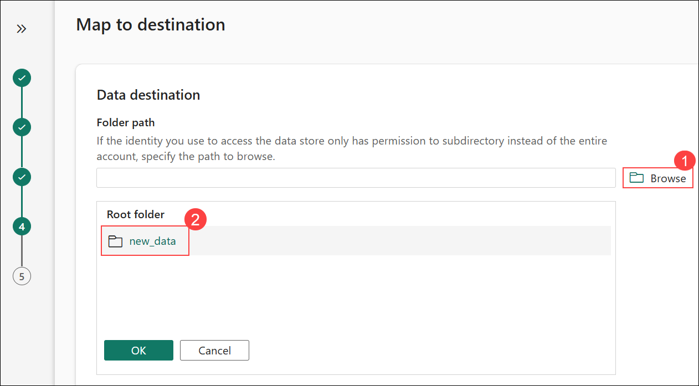

# Exercise 2: Ingest data with a pipeline in Microsoft Fabric

### Estimated Duration: 90 minutes

## Overview

A data lakehouse is a common analytical data store for cloud-scale analytics solutions. One of the core tasks of a data engineer is to implement and manage the ingestion of data from multiple operational data sources into the lakehouse. In Microsoft Fabric, you can implement *extract, transform, and load* (ETL) or *extract, load, and transform* (ELT) solutions for data ingestion through the creation of *pipelines*.

Fabric also supports Apache Spark, enabling you to write and run code to process data at scale. By combining the pipeline and Spark capabilities in Fabric, you can implement complex data ingestion logic that copies data from external sources into the OneLake storage on which the lakehouse is based and then uses Spark code to perform custom data transformations before loading it into tables for analysis.

## Lab objectives

You will be able to complete the following tasks:

- Task 1: Create a Lakehouse
- Task 2: Explore shortcuts
- Task 3: Create a pipeline
- Task 4: Create a notebook
- Task 5: Use SQL to query tables
- Task 6: Create a visual query
- Task 7: Create a report
- Task 8: Analyze report using Fabric Copilot
  
### Task 1: Create a Lakehouse

Large-scale data analytics solutions have traditionally been built around a *data warehouse*, in which data is stored in relational tables and queried using SQL. The growth in "big data" (characterized by high *volumes*, *variety*, and *velocity* of new data assets) together with the availability of low-cost storage and cloud-scale distributed computing technologies has led to an alternative approach to analytical data storage; the *data lake*. In a data lake, data is stored as files without imposing a fixed schema for storage. Increasingly, data engineers and analysts seek to benefit from the best features of both of these approaches by combining them in a *data lakehouse*; in which data is stored in files in a data lake and a relational schema is applied to them as a metadata layer so that they can be queried using traditional SQL semantics.

In Microsoft Fabric, a lakehouse provides highly scalable file storage in a *OneLake* store (built on Azure Data Lake Store Gen2) with a metastore for relational objects such as tables and views based on the open source *Delta Lake* table format. Delta Lake enables you to define a schema of tables in your lakehouse that you can query using SQL.

Now that you have created a workspace in the previous step, it's time to switch to the *Data engineering* experience in the portal and create a data lakehouse into which you will ingest data.

1. Select **Workspaces (1)**, and then choose your workspace **fabric-<inject key="DeploymentID" enableCopy="false"/> (2)**.

    

1. In your workspace, select **+ New item**.

    

1. In the **New item** pane, search for **Lakehouse (1)**, and then select **Lakehouse (2)**.

    

1. On the **New lakehouse**, enter the following:

    - **Name:** Enter **Lakehouse_<inject key="DeploymentID" enableCopy="false"/> (1)**

    - Click on **Create (2)**.

        

        >**Note:** After a minute or so, a new lakehouse with no **Tables** or **Files** will be created.

1. On the **Lakehouse_<inject key="DeploymentID" enableCopy="false"/>** tab, in the **Files (1)** node, select the `...` menu, and then choose **New subfolder (2)**.

    

1. Create a subfolder named **new_data (1)** and click on **Create (2)**.

    

### Task 2: Explore shortcuts

In many scenarios, the data you need to work within your lakehouse may be stored in some other location. While there are many ways to ingest data into the OneLake storage for your lakehouse, another option is to instead create a *shortcut*. Shortcuts enable you to include externally sourced data in your analytics solution without the overhead and risk of data inconsistency associated with copying it.

1. In the `...` **(1)** menu for the **Files** folder, select **New shortcut (2)**.

    

1. View the available data source types for shortcuts. Then close the **New shortcut** dialog box without creating a shortcut.

    

### Task 3: Create a pipeline

In this task, you will create a data pipeline in Microsoft Fabric to ingest data by configuring a **Copy Data** activity, which extracts data from a specified source and loads it into your lakehouse.  

1. On the **Home** page, select **Get data (1)**, and then choose **New copy job (2)**.

    

    > **Note:** The **Copy job** experience creates a **data pipeline** in the background with a **Copy Data** activity, enabling you to perform data ingestion using a simplified interface.

1. In the **New Copy job** pane, enter **Ingest Sales Data Pipeline (1)** in the **Name** field, and then select **Create (2)**.

    
   
1. In the **Choose data source** step, search for **http (1)**, and then select **Http (2)**.

    

1. In the **Connection settings** pane, enter the following details:

    - **URL (1):** `https://raw.githubusercontent.com/MicrosoftLearning/dp-data/main/sales.csv`
    - **Connection (2):** Select **Create new connection**
    - **Connection name (3):** Enter **Connection<inject key="DeploymentID" enableCopy="false"/>**
    - **Authentication kind (4):** Select **Anonymous**
    - Click on **Next (5)**
  
        
    
1. In the **Choose data** step, ensure **Request method (1)** is set to **GET**, keep the remaining settings as default, and then select **Next (2)**.

    
   
1. In the **Choose data** step, ensure the following settings are selected:

    - File format: **DelimitedText (1)**
    - Column delimiter: **Comma (,) (2)**
    - Row delimiter: **Line feed (\n) (3)**
    - Select **Preview data (4)** to see a sample of the data that will be ingested.

        

1. In the **Preview data** pane, review the data, and then select **Close**.

    

1. In the **Choose data** step, verify the settings and then select **Next**.

    

1. In the **Settings** step, ensure **Full copy (1)** is selected, choose **Files (2)** under **Destination root folder**, and then select **Next (3)**.

    

1. In the **Map to destination** step, select **Browse (1)**, choose **new_data (2)**, and then select **OK**.

    

1. In the **Map to destination** step, verify **Folder path (1)** is set to **new_data**, **File name (2)** is **sales.csv**, and then select **Next (3)**.

    

1. In the **Map to destination** step, set the following file format options:

    - **File format (1):** DelimitedText  
    - **Column delimiter (2):** Comma (,)  
    - **Row delimiter (3):** Line feed (\n)  
    - Then select **Next (4)**.

        

1. In the **Review + save** step, review the summary, and then select **Save + Run**.

    

1. When the pipeline starts to run, monitor the status in the **Results** pane, use the **Refresh** icon to update the status, and wait until it shows **Succeeded**.

    

1. Select **Workspaces (1)**, and then choose your workspace **fabric-<inject key="DeploymentID" enableCopy="false"/> (2)**.

    

1. In your workspace, select **Lakehouse_<inject key="DeploymentID" enableCopy="false"/>**.

    

1. In the **Lakehouse_<inject key="DeploymentID" enableCopy="false"/>** pane, expand **Files (1)**, select the **new_data (2)** folder, and verify the **sales.csv (3)** file.

    

   >**Note:** If you are unable to see the **sales.csv** file under **Files**, right-click on **Files** and select **Refresh**.

1. Select the **sales.csv** file to preview its contents.

    

1. In the **Lakehouse_<inject key="DeploymentID" enableCopy="false"/>** pane, select the `... (1)` menu for **Files**, and then choose **Properties (2)**.

    

1. In the **Properties** pane, copy the **ABFS path**.

    

    > **Note:** The **ABFS path** (Azure Blob File System path) is the fully qualified path to your Lakehouse storage in OneLake, used to access data programmatically.

### Task 4: Create a notebook

In this task, you will create a notebook within Microsoft Fabric to develop and execute code for data processing and analysis. Notebooks provide an interactive environment for writing and running code in multiple languages, facilitating data engineering and data science workflows.

1. On the **Home** page, select **Open notebook (1)**, and then choose **New notebook (2)**.

    

    >**Note:** After a few seconds, a new notebook containing a single *cell* will open. Notebooks are made up of one or more cells that can contain *code* or *markdown* (formatted text).

1. If the **Notebook Copilot Updates and Git Integration Supporting Resources** pop-up appears, select **Skip for now**.

    

1. In the notebook, replace the existing code with the variable declaration **table_name = "sales" (1)**, and click on **&#9655; Run**.

    ```python
   table_name = "sales"
    ```

    

1. In the **... (1)** menu for the cell (at its top-right) select **Toggle parameter cell (2)**. This configures the cell so that the variables declared in it are treated as parameters when running the notebook from a pipeline.

     

1. Select **+ Code** to add a new code cell.

    

    > **Note:** You may need to hover your mouse below the existing cell to see the **+ Code** option.

1. Add a new code cell, paste the code **(1)**, and then select **Run (2)**.

    ```python
   from pyspark.sql.functions import *

   # Read the new sales data
   df = spark.read.format("csv").option("header","true").option("inferSchema","true").load("Files/new_data/*.csv")

   ## Add month and year columns
   df = df.withColumn("Year", year(col("OrderDate"))).withColumn("Month", month(col("OrderDate")))

   # Derive FirstName and LastName columns
   df = df.withColumn("FirstName", split(col("CustomerName"), " ").getItem(0)).withColumn("LastName", split(col("CustomerName"), " ").getItem(1))

   # Filter and reorder columns
   df = df["SalesOrderNumber", "SalesOrderLineNumber", "OrderDate", "Year", "Month", "FirstName", "LastName", "EmailAddress", "Item", "Quantity", "UnitPrice", "TaxAmount"]

   # Load the data into a managed table
   #Managed tables are tables for which both the schema metadata and the data files are managed by Fabric. The data files for the table are created in the Tables folder.
   df.write.format("delta").mode("append").saveAsTable(table_name)
    ```

    
    
    >**Note:** This code loads the data from the sales.csv file that was ingested by the **Copy Data** activity, applies some transformation logic, and saves the transformed data as a **managed table** - appending the data if the table already exists.

    > **Note**: Since this is the first time you've run any Spark code in this session, the Spark pool must be started. This means that the first cell can take a minute or so to complete.

1. **(Optional)** You can also create **external tables** for which the schema metadata is defined in the metastore for the lakehouse, but the data files are stored in an external location.

    ```python
    df.write.format("delta").saveAsTable("external_sales", path="<abfs_path>/external_sales")

    #In the Lakehouse explorer pane, in the ... menu for the Files folder, select Copy ABFS path.

    #The ABFS path is the fully qualified path to the Files folder in the OneLake storage for your lakehouse - similar to this:

    #abfss://workspace@tenant-onelake.dfs.fabric.microsoft.com/lakehousename.Lakehouse/Files
    ```
    > **Note**: No need to run. To run the above code, you need to replace the <abfs_path> with your abfs path

1. When the notebook run has completed, select **Workspaces (1)**, and then choose your workspace **fabric-<inject key="DeploymentID" enableCopy="false"/> (2)**.

    

1. In your workspace, select **Lakehouse_<inject key="DeploymentID" enableCopy="false"/>**.

    

1. In the **Tables** section, select the `... (1)` menu, and then choose **Refresh (2)**.

    

1. In the **Lakehouse_<inject key="DeploymentID" enableCopy="false"/>** pane, expand **Tables (1)**, expand **dbo (2)**, and verify the **sales (3)** table.

    

1. In the notebook, select the **Save** icon.

    

1. In the **Save as new notebook** pane, enter **Load Sales Notebook (1)** in the **Name** field, and then select **Save (2)**.

    
 
1. In the hub menu bar on the left, select your lakehouse **Lakehouse_<inject key="DeploymentID" enableCopy="false"/> (1)**. In the **Explorer** pane, refresh the view. Then expand **Tables (2)**, and select the **sales (3)** table to see a preview of the data it contains **(4)**.

   

### Task 5: Use SQL to query tables

In this task, you will utilize the SQL analytics endpoint automatically created for your lakehouse to execute SQL queries on your defined tables.  

When you create a lakehouse and define tables in it, an SQL endpoint is automatically created through which the tables can be queried using SQL `SELECT` statements.

1. At the top-right, select the **Lakehouse (1)** dropdown, choose **SQL analytics endpoint (2)**, and wait for the SQL endpoint to open.

    

1. On the toolbar, select the **New SQL query (1)** dropdown, and then choose **New SQL query (2)**.

    

1. In the query editor, enter the SQL query **(2)**, and then select **Run (1)**.

    ```SQL
   SELECT Item, SUM(Quantity * UnitPrice) AS Revenue
   FROM sales
   GROUP BY Item
   ORDER BY Revenue DESC;
    ```

   

1. View the query results, which display the total revenue for each product.

    

### Task 6: Create a visual query

In this task, you will utilize the visual query editor in Microsoft Fabric to create queries without writing code. This approach leverages Power Query skills, enabling data analysts familiar with Power BI to design visual queries efficiently. 

1. On the toolbar, select the **New SQL query (1)** dropdown, and then choose **New visual query (2)**.

    

1. Drag the **sales** table to the new visual query editor pane that opens to create a Power Query as shown here: 

    

1. In the **Manage columns (1)** menu, select **Choose columns (2)**. Then select only the **SalesOrderNumber** and **SalesOrderLineNumber** **(3)** columns and click on **OK (4)**.

    

    

1. Click on **+ (1)**, in the **Transform table** menu, select **Group by (2)**.

    

1. Then group the data by using the following **Basic** settings and click on **OK (5)**.

    - **Group by**: Select **SalesOrderNumber (1)**
    - **New column name**: Enter **LineItems (2)**
    - **Operation**: Select **Count distinct values (3)**
    - **Column**: Select **SalesOrderLineNumber (4)**

        

1. When you're done, the results pane under the visual query shows the number of line items for each sales order.

    

### Task 7: Create a report

In this task, you will create a Power BI report by leveraging the default dataset automatically generated from your lakehouse tables. This process enables you to visualize and analyze your data effectively using Power BI's reporting capabilities.  

1. From the left-navigation pane of the SQL Endpoint page, select the **Model layouts** tab. The data model schema for the dataset is shown.

    

    > **Note**: In this exercise, the data model consists of a single table. In a real-world scenario, you would likely create multiple tables in your lakehouse, each of which would be included in the model. You could then define relationships between these tables in the model.

1. In the menu ribbon, select the **Reporting (1)** tab. Then select **New report (2)**. A new browser tab opens in which you can design your report.

    

    >**Note:** On the **New report with all available data** select **Continue**.

         

1. In the **Data (1)** pane on the right, expand the **sales (2)** table. Then select the following fields:
    - **Item (3)**
    - **Quantity (4)**

        >**Note:** A table visualization is added to the report **(5)**:

        

1. Hide the **Data** and **Filters** panes to create more space. Then ensure the table visualization is selected and in the **Visualizations** pane, change the visualization to a **Clustered bar chart** and resize it as shown here.

    

1. On the **File** menu, select **Save**. 

    

1. Then save the report as **Item Sales Report (1)** in the workspace you created previously and click on **Save (2)** .

    

1. Close the browser tab containing the report to return to the SQL endpoint for your lakehouse. Then, in the hub menu bar on the left, select your workspace to verify that it contains the following items:
    - Your lakehouse.
    - The SQL endpoint for your lakehouse.
    - A default dataset for the tables in your lakehouse.
    - The **Item Sales Report** report.

          

1. Click on the **Back button** to navigate back to the report page.   

    

> **Congratulations** on completing the task! Now, it's time to validate it. Here are the steps:

   - Hit the Validate button for the corresponding task. If you receive a success message, you can proceed to the next task. 
   - If not, carefully read the error message and retry the step, following the instructions in the lab guide.
   - If you need any assistance, please contact us at cloudlabs-support@spektrasystems.com. We are available 24/7 to help you out.

<validation step="d21cafee-3ca1-4848-b6d2-04c021e4fce3" />

### Task 8: Analyze report using Fabric Copilot

In this task, you will utilize Fabric Copilot to analyze your report, enabling you to gain deeper insights and enhance your data-driven decision-making process.

1. Click on **Copilot (1)** button at the right of the screen to open the copilot chat window, and select **Get Started (2)**.

   

1. Select the first input to copilot as **Give me an executive summary**.

    

1. Ask copilot **Split the Item column on the ' ', creating three new fields called Description, Color and Size** or **Publish the Report** and analyze the output. 

   

1. After a few seconds, ask diffrent question to copilot **provide me insights of sales on Mountain-200, Silver 46** and read the output to understand the data gathered by copilot.

   

1. Provide another prompt to copilot **what all insights will be valuable from the data we have to double the products sales** and wait for the result. it sometimes take 2 to 5 min.

    

1. Once you receive output from the above prompt, read the output and provide another input to copilot **for all the products**. it will provide potential insights and enhancement for the products sale. 

   

1. You can also try different input prompts to analyze the data more efficiently with the help of copilot.

1. Click on **X** to quit Data Engineering.

   

    >**Note:** If the **Are you sure you want to exit** pop-up appears, click on **Yes**.  


### Summary

In this exercise, you have created a lakehouse and imported data into it. You've seen how a lakehouse consists of files and tables stored in a OneLake data store. The managed tables can be queried using SQL, and are included in a default dataset to support data visualizations.

### Review

In this lab, you have completed:

 + Task 1: Create a Lakehouse
 + Task 2: Explore shortcuts
 + Task 3: Create a pipeline
 + Task 4: Create a notebook
 + Task 5: Use SQL to query tables
 + Task 6: Create a visual query
 + Task 7: Create a report
 + Task 8: Analyze report using Fabric Copilot

### You have successfully completed the lab. Click on **Next >>** to procced with next Exercise.
