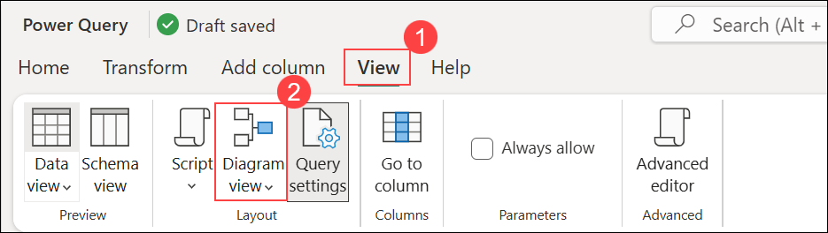

# Exercise 3: Data Engineering Ingest Data in Fabric with Fabric Copilot

### Estimated Duration: 80 minutes

## Overview

In the exercise, you will create a simple data pipeline to bring in customer sales data. You are using the KiZAN Fabric Tenant - where we have Copilot enabled, demonstrate doing the same thing, but by using a new Data Flow Gen2 And leveraging the native integration of Copilot to use natural language to ingest and transform your data.

## Lab objectives

You will be able to complete the following tasks:

- Task 1: Create New - Dataflow Gen2
 
### Task 1: Create New - Dataflow Gen2

In this task, you will create a new **Dataflow Gen2** in Microsoft Fabric's Data Factory, utilizing Copilot's natural language capabilities to ingest and transform data efficiently.

1. Select **Workspaces (1)**, and then choose your workspace **fabric-<inject key="DeploymentID" enableCopy="false"/> (2)**.

    

1. In your workspace, select **+ New item**.

    

1. In the **New item** pane, search for **Dataflow Gen2 (1)** and then select **Dataflow Gen2 (2)**.

    
   
1. In the **New Dataflow Gen2 (CI/CD)** pane, enter **sales-dataflow (1)** in the **Name** field, and then select **Create (2)**.

    

1. After a few seconds, the Power Query editor for your new dataflow opens as shown here.

   

1. Select **Import from a Text/CSV file**.

   

1. On the **Connect to data source** page, create a new data source with the following settings:

    - Connection settings: Select **Link to file (1)**
    - File path or URL: `https://raw.githubusercontent.com/MicrosoftLearning/dp-data/main/sales.csv` **(2)**
    - Connection: **Create new connection (3)**
    - Connection name: **sales-csv-connection (4)**
    - Authentication kind: **Anonymous (5)**
    - Click on **Next (6)**.

      

1. On **Preview file data** page, Click on **Create**.

   

1. In the toolbar, select the **More options** drop-down on the right side.

   

1. From the toolbar, select **Copilot**.

   

1. To better illustrate all that Copilot is doing for you, you expand the UI a little to see what's going on behind the scenes.

1. Select **View (1)**, and then choose **Diagram view (2)**.

   

1. Verify that the query steps are displayed in the **Diagram view**.

    

1. Looking at the data… Notice the **Item** Column. This is really three different fields -- It contains a short **description of the item, a color and a size**.

   

1.	The fields are not consistently delimited (' ' and then ',')

1. In the **Copilot** pane, select **Add a step that...**.

   

   > **Note:** You can also type `Add a step that` and continue; it works the same.

   

1. In the **Copilot** pane, enter the prompt **(1)** and then select **Send (2)**.

    ```
    Add a step that in the Item column, remove the ','
    ```

    
 
1. Verify that the **Item** column now uses a consistent delimiter of space **' '**.

   

1. In the **Copilot** pane, enter the prompt in the input box **(1)** and then select **Send (2)**.

    ```
    Add a step that split the Item column on the ' ', creating three new fields called Description, Color and Size
    ```

    

1. In the **View** tab, select **Script view** and review the generated M-code along with the new query step added by Copilot.

   
 
1. Here is a concise summary highlighting the impacts of Visual Query and M-Query/M-Code scripting:

1. **Visual Query**:
   - **Streamlines data exploration**: Visual Query tools offer intuitive interfaces, enabling users to interact with data visually, and facilitating quicker insights without extensive coding.
   - **Enhances accessibility**: With Visual Query, users with varying technical expertise can extract insights from data, reducing reliance on specialized programming skills and promoting broader data utilization across teams.

1. **M-Query/M-Code scripting**:
   - **Enables advanced data manipulation**: M-Query/M-Code scripting provides a robust framework for performing intricate data transformations and analysis, empowering users to tailor processes to specific requirements beyond the capabilities of visual tools.
   - **Facilitates automation and customization**: Through M-Query/M-Code scripting, users can automate repetitive tasks, build custom functions, and create tailored solutions, increasing efficiency and flexibility in data workflows.

### Summary

In this exercise, you learned how to ingest data into Microsoft Fabric using Fabric Copilot. The lab covered setting up data pipelines, automating data ingestion processes, and leveraging Fabric Copilot to streamline data operations. You practiced loading datasets into Fabric, explored different ingestion methods, and understood best practices for managing large-scale data workflows. By the end of the lab, you gained hands-on experience in efficient data ingestion within Fabric.

### Review
In this lab, you have completed:

  + Create New - Dataflow Gen2

### You have successfully completed the lab. Click on Next >> to procced with next Exercise.
