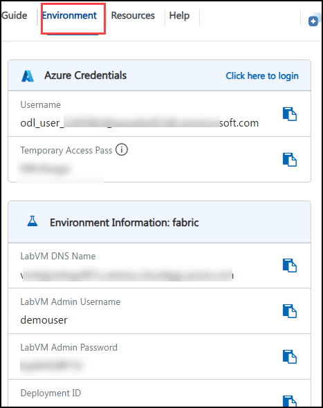
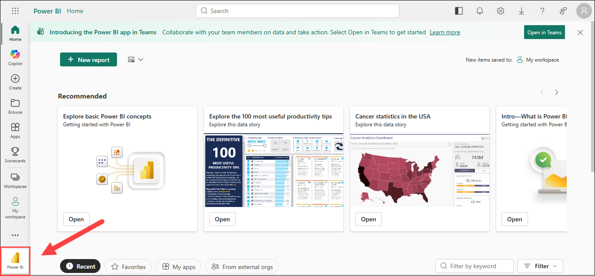
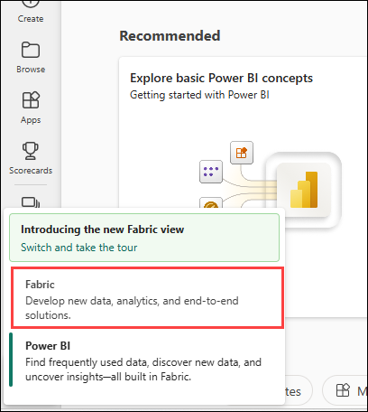
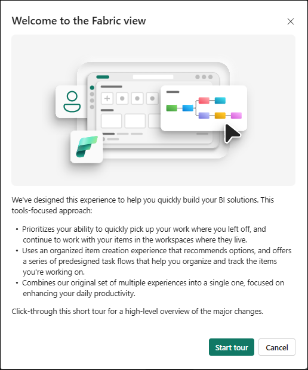
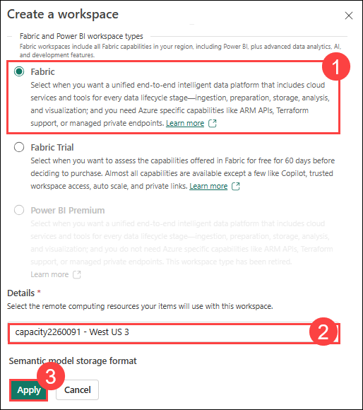

# How to use Apache Spark in Microsoft Fabric

### Overall Estimated Duration: 4 Hours

## Lab Scenario 

**Contoso Retail** is a global consumer electronics and department store chain operating both physical brick-and-mortar stores and a major e-commerce platform (contoso.com). Currently, Contoso’s sales data is siloed across different platforms: online sales transactions from the website are captured in a cloud-based SQL database, while regional store managers upload daily physical store sales as flat CSV files to an Azure Blob Storage account.

To gain a holistic view of company performance, the Contoso executive team wants a unified analytics platform. As a Data Engineer at Contoso, your task is to build an automated ETL pipeline in Microsoft Fabric. You will use Dataflows (Gen2) to clean the messy physical store files, use Apache Spark Notebooks to handle the high-volume online sales data and perform advanced aggregations, and orchestrate the entire end-to-end process using Fabric Data Pipelines.

## Overview

This lab provides an introduction to Dataflows (Gen2) and Data Pipelines in Microsoft Fabric, focusing on their role in data ingestion, transformation, and automation. Participants will explore how Dataflows (Gen2) connect to various data sources, perform transformations using Power Query Online, and integrate with Data Pipelines to load data into a lakehouse or analytical store. The lab will also cover building and orchestrating pipelines using the Fabric user interface, enabling automation of extract, transform, and load (ETL) processes without extensive coding.

## Objective

By the end of this lab, you will be able to:

- **Analyze data with Apache Spark:** You will learn how to use Apache Spark within Microsoft Fabric to explore and analyze large datasets. This task will guide you through creating Spark notebooks, running distributed data processing tasks, and performing data transformations to gain meaningful insights.

- **Create a Dataflow (Gen2) in Microsoft Fabric:** You will learn how to create and configure Dataflows (Gen2) to connect to data sources and perform transformations using Power Query Online. This task introduces the core features of Dataflows and demonstrates how they can be used in pipelines or Power BI datasets.

- **Ingest data with a pipeline:** You will learn how to build data pipelines to ingest data from external sources into a lakehouse in Microsoft Fabric. This includes using Apache Spark to apply custom transformations before loading the data for analysis.

## Pre-requisites

- Foundational understanding of Microsoft Fabric and its core components
- Familiarity with data ingestion and transformation concepts
- Basic knowledge of Power Query and its role in data preparation

## Architecture

The architecture of this lab revolves around Microsoft Fabric’s Dataflows (Gen2) and Data Pipelines, forming a seamless framework for data ingestion, transformation, and automation. Dataflows (Gen2) serve as the entry point, connecting to diverse data sources and leveraging Power Query Online for data transformation. These transformed datasets integrate with Data Pipelines, which orchestrate data movement into a lakehouse or analytical store. The Fabric user interface facilitates pipeline construction and automation, streamlining extract, transform, and load (ETL) workflows without requiring extensive coding, thereby enhancing efficiency and scalability in data processing.

## Architecture Diagram

 

## Explanation of Components

- **Lakehouse:** The lakehouse in Microsoft Fabric provides a unified data architecture that combines the scalability of a data lake with the relational capabilities of a data warehouse. It serves as the central storage layer for both raw and processed data, supporting analytics and reporting.

- **Notebook:** Notebooks offer an interactive environment for data exploration and transformation using Apache Spark. They enable users to write code, execute queries, visualize results, and perform advanced analytics directly within Fabric.

- **Dataflow (Gen2):** Dataflows (Gen2) are a low-code data preparation tool designed to ingest, clean, and transform data from various sources. They can be connected to destinations such as lakehouses and integrated into pipelines for streamlined processing.

- **Pipeline:** Pipelines provide orchestration and automation of data workflows in Fabric. They integrate activities such as notebooks and dataflows into a sequence, enabling end-to-end automation of ingestion, transformation, and analysis processes.

## Getting Started with Lab

Welcome to your How to use Apache Spark in Microsoft Fabric Workshop! We've prepared a seamless environment for you to explore and learn about the services. Let's begin by making the most of this experience.
 
## Accessing Your Lab Environment
 
Once you're ready to dive in, your virtual machine and **Guide** will be right at your fingertips within your web browser.

 
 
## Virtual Machine & Lab Guide

Your virtual machine is your workhorse throughout the workshop. The lab guide is your roadmap to success.

## Exploring Your Lab Resources
 
To get a better understanding of your lab resources and credentials, navigate to the **Environment** tab. Here, you will find the Azure credentials. Click on the **Environment** option to verify the credentials.
 
  
 
## Utilizing the Split Window Feature
 
For convenience, you can open the lab guide in a separate window by selecting the **Split Window** button from the top right corner.
 
  

## Managing Your Virtual Machine
 
Feel free to **Start, Stop**, or **Restart (2)** your virtual machine as needed from the **Resources (1)** tab. Your experience is in your hands!

   

## Utilizing the Zoom In/Out Feature

To adjust the zoom level for the environment page, click the **A↕ : 100%** icon located next to the timer in the lab environment.

   

## Let's Get Started with Fabric Portal

1. In the LabVM, click on the **Microsoft Edge** browser, which is available on the desktop.

   

1. Copy the **Fabric link** below and open this link in a new tab on the Microsoft Edge Browser.

   ```
   https://app.fabric.microsoft.com
   ```
   
1. On the **Enter your email, we'll check if you need to create a new account** tab, you will see the login screen, in that enter the following email/username, and click on **Submit (2)**.
 
   - **Email/Username:** <inject key="AzureAdUserEmail"></inject> **(1)**

     

1. Now enter the following password and click on **Sign in (2)**.
 
   - **Password:** <inject key="AzureAdUserPassword"></inject> **(1)** 

      

1. If you see a pop-up **Stay Signed in?**, click **No**.

   

1. You will be navigated to the PowerBI Home page and click on the **powerBI icon** on bottom-left corner

    

1. To switch from the Power BI page view to the Fabric page view, select the **Fabric** option.

   

1. This opens the Fabric home page. You can either start the tour or close the **welcome to Fabric view** pop-up and continue.

   

1. Click the **Profile (1)** icon from the top-right corner, then select **Free trial (2)** to activate your Microsoft Fabric trial license.

     

1. On the **Activate your 60-day free Fabric trial capacity** pop-up, click the **Activate** button to proceed.  

      
   
1. Once the trial capacity is ready and the confirmation message appears, click **Ok** to start working in Fabric.

      

1. When the **Invite teammates to try Fabric** pop-up appears, click the **Close (X)** button at the top-right corner to dismiss it and proceed.

    

1. Open the **Account Manager** again and observe the new **Trial Status** section, which displays the number of days remaining in your trial.

    

      > **Note:** You now have a **Fabric (Preview) trial** that includes a **Fabric (Preview) trial capacity**.

1. From the left pane, select **Workspaces (1)**, then click **+ New workspace (2)** at the bottom.

      

1. In the **Create a workspace** dialog box, enter the name as **fabric-<inject key="DeploymentID" enableCopy="false"/>** **(1)**, then click **Apply (2)** to create the workspace.

     

1. Make sure to select workspace type as **Fabric (1)** and in details select **fabric<inject key="DeploymentID" enableCopy="false"/> - West US 3**  **(2)** and click on **Apply (3)**

   
   
1. When your new workspace opens, it should appear empty, as shown in the image.

    

## Support Contact

The CloudLabs support team is available 24/7, 365 days a year, via email and live chat to ensure seamless assistance at any time. We offer dedicated support channels tailored specifically for both learners and instructors, ensuring that all your needs are promptly and efficiently addressed.

Learner Support Contacts:

- Email Support: cloudlabs-support@spektrasystems.com
- Live Chat Support: https://cloudlabs.ai/labs-support

Now, click on **Next >>** from the lower right corner to move on to the next page.
   


## Happy Learning!!
